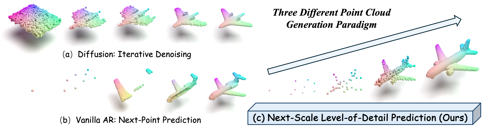

# PointNSP: Autoregressive 3D Point Cloud Generation with Next-Scale Level-of-Detail Prediction

A two-stage coarse-to-fine framework for high-quality 3D point cloud generation. Stage 1 learns multi-scale discrete representations via VQVAE; Stage 2 autoregressively predicts next-scale tokens via a causal transformer.



## Dataset

Download the ShapeNet point clouds (pre-sampled 15k points) from this [link](https://drive.google.com/drive/folders/1MMRp7mMvRj8-tORDaGTJvrAeCMYTWU2j) and place under `data/`:

```
data/ShapeNetCore.v2.PC15k/
├── 02691156/       # airplane
│   ├── train/
│   ├── val/
│   └── test/
├── 03001627/       # chair
├── 02958343/       # car
└── ...
```

## Training

### Stage 1: Multi-Scale VQVAE

```bash
# PointNSP-m (paper default: hidden=1024, codebook=8192, 10 scales)
python train_vqvae.py --config configs/vqvae_medium.yaml

# PointNSP-s (lightweight: hidden=512, codebook=4096)
python train_vqvae.py --config configs/vqvae_small.yaml

# Resume from checkpoint
python train_vqvae.py --config configs/vqvae_medium.yaml --resume checkpoints/vqvae_best.pt
```

### Stage 2: Autoregressive Transformer

```bash
# Online tokenization (stochastic FPS augmentation each epoch)
python train_transformer.py --config configs/transformer_medium.yaml \
    --vqvae_ckpt checkpoints/vqvae_best.pt

# Fast training with pre-tokenized data
python train_transformer_fast.py --config configs/transformer_medium.yaml \
    --tokenized_data data/tokenized/airplane_train.pt
```

### Generation

```bash
python generate.py \
    --vqvae_ckpt checkpoints/vqvae_best.pt \
    --transformer_ckpt checkpoints/transformer_best.pt \
    --num_samples 64 \
    --output_dir generated/
```

## Project Structure

```
model/
├── vqvae_model.py          # Multi-Scale VQVAE (Algorithm 1 & 2)
├── transformer.py          # Autoregressive Transformer (Stage 2)
├── pvcnn/                  # Point-Voxel CNN encoder
├── fps.py                  # Farthest Point Sampling + LoD sequence
├── upsampling.py           # PU-Net upsampling
├── positional_encoding.py  # BAPE + scale embedding
├── masking.py              # Block-wise causal mask + position-aware soft mask
configs/                    # YAML configs for PointNSP-s and PointNSP-m
datasets/                   # ShapeNet data loaders
```